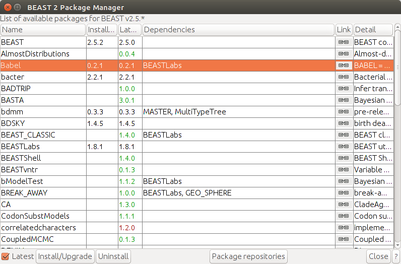
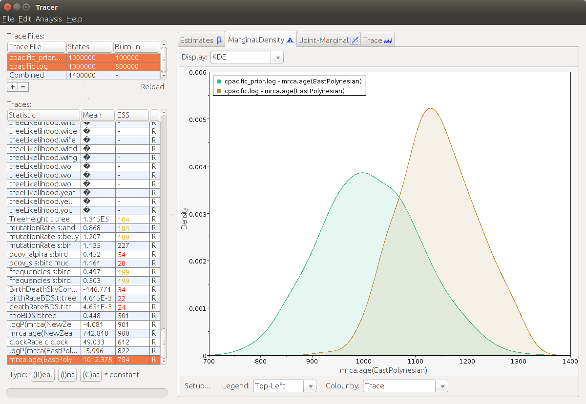
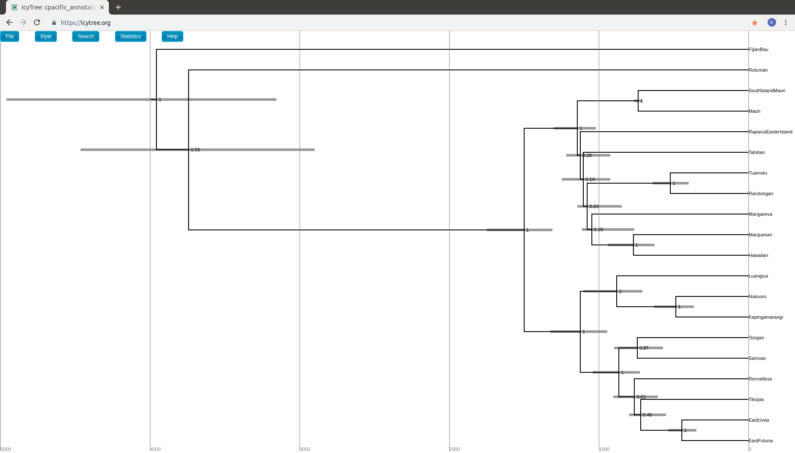

# Language Phylogenies: Using Babel to analyse linguistic data

# Background

Bayesian phylogenies are widely used in comparative linguistics. They not only provide information about the relationship of different languages, but also test hypotheses concerning the ages of language families . Dataset can contain grammatical features such as "has productive plural marking on nouns" or statistics of what cognates exist. The languages are then encoded as a binary string representing the presence or absence of these features. This forms the "sequence alignment matrix" on which the phylogeny is built.

In this tutorial we will analyse a minor selection of Central Pacific languages and focus on the steps that are required in a linguistic analysis. These linguistic data come from 20 languages spoken in Polynesia in the Pacific including Hawaiian, Fijian, Tahitian, Tongan, Samoan, Rapanui (spoken on Easter Island) and Maori (spoken in New Zealand). This group of languages form the "Central Pacific” clade of the great Austronesian language family which originated in Taiwan around 5000 years ago, and spread throughout the Pacific from Madagascar to Easter Island .

This dataset contains binary data demarcating the presence or absence of ‘cognates’, which are homologous word forms inherited from the common ancestor of these languages (“Proto-Central Pacific”). The raw linguistic data are available on the [Austronesian Basic Vocabulary Database website](https://abvd.shh.mpg.de/austronesian/), and more information about the relationships of these languages and the research behind this classification  can be found at Glottolog, with links to the primary research here: https://glottolog.org/resource/languoid/id/cent2060.

----

# Programs used in this Exercise

### BEAST2 - Bayesian Evolutionary Analysis Sampling Trees 2

BEAST2 ([beast2.org](https://www.beast2.org)) is a free software package for Bayesian evolutionary analysis of molecular sequences using MCMC and strictly oriented toward inference using rooted, time-measured phylogenetic trees. This tutorial is written for BEAST v2.5.2

### BEAUti2 - Bayesian Evolutionary Analysis Utility

BEAUti2 is a graphical user interface tool for generating BEAST2 XML configuration files.

Both BEAST2 and BEAUti2 are Java programs, which means that the exact same code runs on all platforms. For us it simply means that the interface will be the same on all platforms. The screenshots used in this tutorial are taken on a Mac OS X computer; however, both programs will have the same layout and functionality on both Windows and Linux. BEAUti2 is provided as a part of the BEAST2 package so you do not need to install it separately.

### Tracer

Tracer ([beast.community/tracer](http://beast.community/tracer)) is used to summarise the posterior estimates of the various parameters sampled by the Markov Chain. This program can be used for visual inspection and to assess convergence. It helps to quickly view median estimates and 95% highest posterior density intervals of the parameters, and calculates the effective sample sizes (ESS) of parameters. It can also be used to investigate potential parameter correlations. We will be using Tracer v1.7.1.

### TreeAnnotator

TreeAnnotator is used to summarise the posterior sample of trees to produce a maximum clade credibility tree. It can also be used to summarise and visualise the posterior estimates of other tree parameters (e.g. node height).

TreeAnnotator is provided as a part of the BEAST2 package so you do not need to install it separately.

### IcyTree

IcyTree ([icytree.org](https://icytree.org)) is a browser-based phylogenetic tree viewer. It is intended for rapid visualisation of phylogenetic tree files. It can also render phylogenetic networks provided in extended Newick format. IcyTree is compatible with current versions of Mozilla Firefox and Google Chrome.

### DensiTree

Bayesian analysis using BEAST2 provides an estimate of the uncertainty in tree space. This distribution is represented by a set of trees, which can be rather large and difficult to interpret. DensiTree is a program for qualitative analysis of sets of trees. DensiTree allows to quickly get an impression of properties of the tree set such as well-supported clades, distribution of tree heights and areas of topological uncertainty.

DensiTree is provided as a part of the BEAST2 package so you do not need to install it separately.

----

# Practical: Creating a language phylogeny

## Installing necessary packages
First we need to install the `Babel` (v. 0.2.1 or above) package for linguistic analyses. Further we will use a Birth-Death model which requires the package `BDSKY` (v. 1.4.5 or above). The latter one can be easily done via the package manager of BEAUti. For `Babel` we first need to add extra repositories to the package manager.
> Open BEAUti.  Go to `File` and `Manage Packages`, click on `Package repositories`. In the new opened window click on `Add URL`, set the URL to **https://raw.githubusercontent.com/CompEvol/CBAN/master/packages-extra.xml**, click `Ok` and close the repository manager via `Done`. Finally select `Babel` from the list and press `Install/Upgrade`. Also install `BDSKY` and optionally (if you want to use a sampled ancestor model) `SA` and **restart BEAUti**.

<figure>
	<a id="fig:packages"></a>
	
	<figcaption>The package explorer in BEAUti</figcaption>
</figure>

## The data set

Before we start we need to make sure that our data is suitable for an analysis with `Babel`. We assume that the alignments consist of **0, 1** and **?** representing the presence, absence or uncertainty of a feature (i.e. cognate or grammatical feature). Babel also assumes that your data has **ascertainment correction** columns. Researchers tend not to collect data that does not vary. This is a form of sampling bias that is often called ascertainment bias . In order to account for that **every first column of every partition of the alignment has to be an ascertainment column**. There all languages have the entry **0** except the ones, where the data is missing, they have a **?**.

The data used in this tutorial is an alignment matrix, where each entry represents the presence or absence of a certain cognate in this specific language. If you open the file `cpacific.nex` in a text editor, you can see that there is the alignment matrix and below a text block indicating, which columns belong the which meaning class. Every first entry of each meaning class is an ascertainment column.

<figure>
	<a id="fig:packages"></a>
	
	<figcaption>Every first character of a meaning class is an ascertainment character</figcaption>
</figure>

<figure>
	<a id="fig:packages"></a>
	
	<figcaption>Columns 1, 6, 12, 16, 19 and 23 are ascertainment columns consisting only of 0 and ?</figcaption>
</figure>

## Setting up the analysis using BEAUti

### Loading the template

A template in BEAUti sets the interface and allows us to select and modify all the interesting parameters. Depending on the model varying combinations of parameters are necessary. Because BEAUti can not account for all possible models, there are so called templates that preset the interface accordingly.

`Babel` comes with some BEAUti-templates that are made specifically for linguistic analyses. These ones are named after the substitution model used in the template. In this tutorial we go with the broadly used Binary Covarion model.

> In BEAUti go to `File > Template` and choose `Binary Covarion`.

### Getting the Data into BEAUti

Next we will import our data set.

> Go to  `File > Add Alignment`, select the file `cpacific.nex`  and click on `Ok`.

You should be able to see your alignment on the screen. There is one partition for every meaning class and they are presorted by the number of sites. We assume that words that have less cognates present also evolve at a slower rate than words that have many varieties. To achieve this we want to have different site models depending on the size of each meaning class. One for size 1-5, another one for size 6-10 and a third one for size 11-15. All partitions that fall in the same group should have linked site models.

> After loading the data select the first partition `orgdata.bird` , hold **Shift**, scroll down and click on `orgdata.year` and press `Link Site Models`. Do the same from `orgdata.and` to `orgdata.wormearthworm` and from `orgdata.belly` to `orgdata.tothrow`.

<figure>
	
	<figcaption>The alignment loaded and partitions grouped in bins of size 5</figcaption>
</figure>

### Choosing a site model

In the `Site Model` tab we usually choose the substitution model for nucleotide data. However for linguistic data we already made this decision with the choice of the BEAUti-template. So we only need to fill in the model parameters.

In the Binary Covarion model each character can have one of four states that are divided into **visible states** and **hidden states**. The visible ones are **0** and **1** and the hidden ones are **fast** and **slow**. Characters change their binary state at a rate **1** in the fast state and at rate **alpha** in the slow state. Furthermore they are allowed to change from one of the hidden categories to another at a **switch rate s**.

For now we stick with the default values of **alpha=0.5, s=0.5** and all the frequencies set to **0.5**. Also we want to set the amount of gamma categories to zero in order to have no rate variation across sites. There are three different implementations of the Binary Covarion model, `BEAST`, `REVERSIBLE` and `TUFFLEYSTEEL`. Unless you know, what you are doing, stick with the default one `BEAST`.

Note that one should make multiple analyses with differing substitution models and check, which one performs best.

<figure>
	
	<figcaption>The site model tab</figcaption>
</figure>

### Clock Model

For simplicity we go for a strict clock in this tutorial, so leave everything in this tab as it is. You can relax the clock later if you want and it is strongly recommended to try varying clock models and see, which one fits best.

### The priors

In this tab we include all our prior knowledge about the evolutionary process to the model. First we need to select a tree prior. There are a lot of possibilities, from a simple Yule model to a complex Birth-Death Skyline model. Which one to choose heavily depends on the data. We want to include the knowledge that we may not have sampled all languages and some languages may have gone extinct. Also we don't have any old languages included. A Birth-Death model with contemporaneous sampling incorporates all these things.

> Click on the tab `Priors` and select `Birth Death Skyline Contemporary BDSParam` from the drop down menu.

Note that there are two contemporary BDSKY-models `Birth Death Skyline Contemporary` and `Birth Death Skyline Contemporary BDSParam` . The difference between these two is that the latter uses the parameters **birth rate** and **death rate** and creates trees starting with their root, while the former uses **reproductive number** (which is birth rate over death rate) and **become uninfectious rate** and starts with the origin of a tree. For our case it makes more sense to use the birth-death-parametrization.

It comes with three parameters, the **birth rate** , the **death rate ** and the **sampling proportion **. In terms of language evolution a birth event happens, if there is a diversification of two languages and a death event is a language going extinct. The sampling proportion is the relative amount of languages in our analysis compared to the total amount of languages existing in the clade.

These three parameters are correlated to each other, so we need to have a strong prior for at least one of these parameters in order to robustly estimate the others. It makes sense to chose the sampling proportion as we know of almost every language spoken in the world. Glottolog  lists 45 Central Pacific languages and we have 20 of them in our data set, so we would expect a sampling proportion of ca. 44%. A good candidate for  is the Beta distribution: It allows values between 0 and 1 and has most of its weight centered around its mean , where we chose for  the amount of sampled languages and for  the amount of unsampled languages.

<figure>
	
	<figcaption>The Beta distribution is great to specify the sampling proportion</figcaption>
</figure>

In the skyline model rates are constant over time, but may change to different values at specific times. This is governed by the dimension of the birth- or death rate parameter. A dimension of 3 means that there are three different values and thus two rate change events (that are by default evenly distributed along the tree). If we would like to have only one overall rate, we need to set the dimension of the birth rate and death rate to 1. For now we stick with constant rates, but later we might want to check if a proper Skyline model with multiple rates performs better.

We don't know how quickly languages die out or emerge, but we know for sure that it doesn't happen every day. A death rate of 0.01 means for example that a language is about 100 years around before it goes extinct. Some language last much longer, some others shorter. A good prior candidate for that would be the exponential distribution. It favors low values close to zero, but also allows higher values if it is necessary. We also can set the initial values of these parameters much lower in order to decrease the burn-in time.

> Click on the black triangle left of `rhoBDS.t:tree`. Make sure that a Beta-distribution is selected and set `Alpha` to **20** and `Beta` to **25**. Then click on the button next to the birth rate prior, which says `initial = [2.0][0.0,Infinity]`, set `Dimension` to **1**, if it is not already by default and the `Value` to **0.01**. Do the same for the death rate, but set this initial value to something slightly lower, e.g. **0.009**.
>
> Then click on the black triangle left of `birthRateBDS.t:tree` and select `Exponential` from the drop down menu. Set the `Mean` value to **0.01**. Repeat this step for `deathRateBDS.t:tree`.

Next we want to add some priors for time calibration. According to , the settlement of New Zealand can be securely dated to between 1230-1282 A.D. We have two dialects of New Zealand Maori in these data: Maori and SouthIslandMaori. Let’s operationalize this calibration like this: If we assume that the present is a nice round number like the year 2000 (this makes interpretation easier), then we convert this to before present:

```
2000 - 1230 = 770 years ago
2000 - 1282 = 718 years ago
```

So a prior incorporating this information could be a tight log-normal distribution with mean 744 (in real space) and a variance 0.02.

> In the priors tab select `+ Add Prior`. You should see a dialog popping up, choose `MRCA prior` and click `Ok`. In the box next to `Taxon Set Label` type **NewZealand**. Search **Maori** and **SouthIslandMaori** in the list, select them and press `>>` to include them in our phylogenetic constraint. At the end press `OK`. Now you should see the `NewZealand.prior` appearing on the priors tab. Check the box `monophyletic` and select the distribution `Log Normal`. Click on the black triangle on the left to specify the parameters of the distribution. Set `M` to **744** and `S` to **0.02** and make sure to have `Mean In Real Space` selected.

Another good calibration is East Polynesian: It’s a well-attested linguistic group, and we have good archaeological evidence for when the initial settlement of East Polynesia began. However the ages are a bit controversial between “short” and “long” chronologies e.g.:

```
1025 - 1121 AD =  975 -  879 years ago 
 800 - 1000 AD = 1200 - 1000 years ago 
```

The average of these estimates is about 1000 years ago, and they are spread on both sides by about 150-
200 years. This makes a great candidate for a Normal distribution with mean 1000 and variance 100.

> Click again on `+ Add Prior` , choose `MRCA prior` and press `Ok`. This time, type **EastPolynesian** as `Taxon Set Label` and add the following languages to the list (by clicking on them and on `>>`):
>
> **Hawaiian, Mangareva, Maori, Marquesan, RapanuiEasterIsland, Rarotongan, SouthIslandMaori, Tahitian, Tuamotu**. After that click `Ok` and check again the box `monophyletic`. As prior distribution select `Normal` and enter the `Mean` of **1000** and `Sigma` of **100**.

<figure>
	
	<figcaption>The calibration priors</figcaption>
</figure>

Finally we want to make sure that all priors are proper. There are uniform priors without upper bound for the clock rate and the slow mutation rate from the Binary Covarion model. One should choose a value that is large enough that the traces don't get close to it. 100 should be generous enough for both parameters. However the analysis will run if you skip this step and might yield useful results, but if we want to compare different analyses and estimate their marginal likelihood it is essential to only have proper priors.

> Expand the prior of `clockRate.c:clock` and set `Upper` to **100** . Do the same for `bcov_alpha.s:bird`.

### The MCMC tab

Here we can specify the length of the run as well as the filenames of the output tree file (where the posterior sample of trees is stored) and the log file (where the posterior sample of parameters is stored). For the purpose of this tutorial, we choose a short chain length of 1 million. Usually the chain length should be large enough to yield a high ESS for every parameter (see next section). Finally we want to save our settings and generate a BEAST2-xml file. It is highly recommended to generate another xml-file with the check box `Sample From Prior` ticked. It is used to verify if the data has enough signal to estimate the parameters or if the posterior results are mainly dominated by the prior choice.

> Click on the `MCMC`-tab. Set the chain length to **1000000** and set the filenames of the log files (tracelog and treelog, screenlog can be left empty) by expanding their respective menu. Select `File > Save As` and enter a filename (e.g. **cpacific.xml**) and click `Ok`. Tick the check box next to `Sample from Prior`, change the file names of the trace log files and tree log files (e.g. **cpacific_prior.log** and **cpacific_prior.trees**) and save again with a different filename (e.g. **cpacific_prior.xml**).

## Running the analysis

Now we are ready to do run the file. Open BEAST 2 and select your generated xml-file as input. The computation should take a while (ca. 30 min. on a modern computer), you can watch it progressing or download the finished output-files.

>Open BEAST 2, select `cpacific.xml` as input-file and click `Open`. Repeat this for the sample-from-prior analysis.

## Processing the results

BEAST 2 now creates multiple files. The Log-file contains all the information about the inferred parameters, in the tree-file we find a posterior sample of the tree space and finally there is a file `cpacific.xml.state` where the current state of the Markov chain is stored, if we want to continue the analysis at some point starting from this state.

### Burn-In and ESS

Tracer provides us some summary statistics of the posterior sample. After loading the log-file we see in the top left corner the filename, the amount of states and the burn-in (which is 10% by default). Below there are all the parameters listed together with their mean values and their effective sample size (ESS). This value should -- as a rule of thumb -- be above 200 for each parameter.

The MCMC-algorithm needs some time for the Markov chain to converge to its stationary state. Click on a parameter and then on `Trace` in the right window. If you can see big jumps, then this is a strong hint that the chain has not converged yet. The first fraction of the run, where the algorithm has not converged yet is called **burn-in** and is discarded. We can adjust the burn-in by clicking on it and typing a new value that covers all observable big jumps.

<figure>
	
	<figcaption>Trace of the posterior. Here a burn-in of 500000 would be appropiate</figcaption>
</figure>

> Open Tracer, click on the `+` in the top left corner to import trace files. Select `cpacific.log `and `cpacific_prior.log` and press `Ok`.

Note that in this example file, most of the ESSes are below 200 as we the chain length of the MCMC to a rather low value.

### Checking out interesting parameters

What are the inferred parameters? How quickly do these languages evolve? There are a lot of values to check, we will go through it. Make sure to compare all results to the ones from the sample-from-prior-run to ensure their validity. Note that the MCMC-algorithm is a stochastic process, so your results might vary a bit from the ones presented here.

**Posterior, prior** and **likelihood**: The posterior -- the product of prior and likelihood -- is the value that the MCMC-algorithm optimizes. Further we have the treelikelihoods for every word. Ideally all of those have an ESS of above 200.

More interesting is the **tree height**. Archaeologists suggest that the first settlement of Fiji happend ca. 3200 years ago. Our estimate has a mean of roughly 3900 years, which seems to be quite far off, but 3200 is still in its 95% HPD interval.

The **mutation rates** of the different word categories are quite striking. We can clearly see slow (bird), medium (and) and fast (belly) mutation rates. You can select all three at once to see them together.

Below are the parameters of the Binary Covarion model followed by the ones of the Birth-death model. We would like to compare the prior with the posterior. In the top left corner you can select both trace files at once (by holding down `ctrl` while clicking). Select e.g. the birth rate parameter and click on `Marginal Density` to see how the data influenced the prior assumptions. In our case the posterior **birth** and **death rates** are overlapping with their prior beliefs, but narrowing down the confidence interval towards much lower rates. The **sampling proportion** matches its prior, which is no surprise as we are conditioning on that.

Last but not least the **MRCA times** of East Polynesia and New Zealand: New Zealand matches its prior -- again the prior was chosen to be very strict and we are sure about this knowledge -- while the time of the East Polynesian clade is a bit older than the prior. Remember that there were two different reports about its clade age. This analysis well supports the "long" chronology.

<figure>
	
	<figcaption>Posterior clade age of East Polynesia compared to its prior belief</figcaption>
</figure>

## Visualizing the trees

Now we will have a look at the generated tree files from the analysis.

### Have a look at all the trees using `IcyTree`

[IcyTree](https://icytree.org) a nice and easy to use web page that displays phylogenetic trees.

> Open the page https://icytree.org in a web browser. Go to `File > Load from file...` and select your tree file (`cpacific.trees`). Press `a` to see a time axis.

This shows us all the trees from our posterior sample. The arrows in the bottom left corner are used to navigate through all the trees.

### MCC tree with `treeannotator`

Treeannotator creates a summary tree out of all the trees from the posterior sample excluding the burn in.

> Open Treeannotator. Set the `Burnin percentage` to **50** percent and specify your input (`cpacific.trees`) and output file (e.g. `cpacific_annotated.trees`). Click on `Run` to start the process.

Then again, IcyTree can be used to show the MCC tree.

> Open again icytree.org and load your annotated tree file. Press `a` to display the time axis. Go to `Style > Internal node text > posterior`  and then to `Style > Node height error bars > height_95%_HPD`. You should now be able to see the posterior probabilities of all the nodes together with their height HPD intervals.

<figure>
	
	<figcaption>The MCC summary tree in IcyTree</figcaption>
</figure>

Interestingly most of the diversification events happened in the past 1500 years and two approximately 3500 years ago according to this analysis. This might be a clue that a model assuming different birth rates might yield better results.

### Compare tree topologies with `DensiTree`

The first branching event after the root has a fairly low support in our MCC-tree. This means that the topology is just the most likely one, but not neccessarily the correct one as other might also have a decent support. To visualize these other topologies `DensiTree` is a nice tool. A detailed description on how to use `DensiTree` is in the tutorial [Introduction to BEAST2](https://taming-the-beast.org/tutorials/Introduction-to-BEAST2/).

> Open DensiTree, click on `File > Load` and select your log file (`cpacific.trees`). Click on the `Burn in`-tab on the right panel and set the burn in (in our case) to $50$.

<figure>
	
	<figcaption>Densitree shows all different topologies at once</figcaption>
</figure>

In many trees Fijian clades together with Rotuman, which leads to the low support of Fijian being outside the other languages in the summary tree. However it does not have a big impact on the timing of the diversification events.

# Further steps

This tutorial is over, but the analysis should not stop here. There are a lot of things to try out and compare: A relaxed clock, other priors on birth and death rate to see how dependent the result are on the priors, varying rates over time, different substitution models and a lot more.

## Nested Sampling

Nested sampling is a great way to compare different models. It gives a marginal likelihood estimate together with a standard deviation. Those can be used to test the support of a model. More about this and a guide on how to set it up in BEAST2 can be found on its github-page https://github.com/BEAST2-Dev/nested-sampling and there is a tutorial on the Taming the BEAST site.

# Useful Links

- BEAST 2 website and documentation: https://www.beast2.org/
- Babel package for linguistic analyses in BEAST2: https://github.com/rbouckaert/Babel
- BDSKY package for BEAST2: https://github.com/BEAST2-Dev/bdsky
- SA package for ancient languages: https://github.com/CompEvol/sampled-ancestors
- Nested Sampling: https://github.com/BEAST2-Dev/nested-sampling [tutorial](https://taming-the-beast.org/tutorials/NS-tutorial/)

# References

